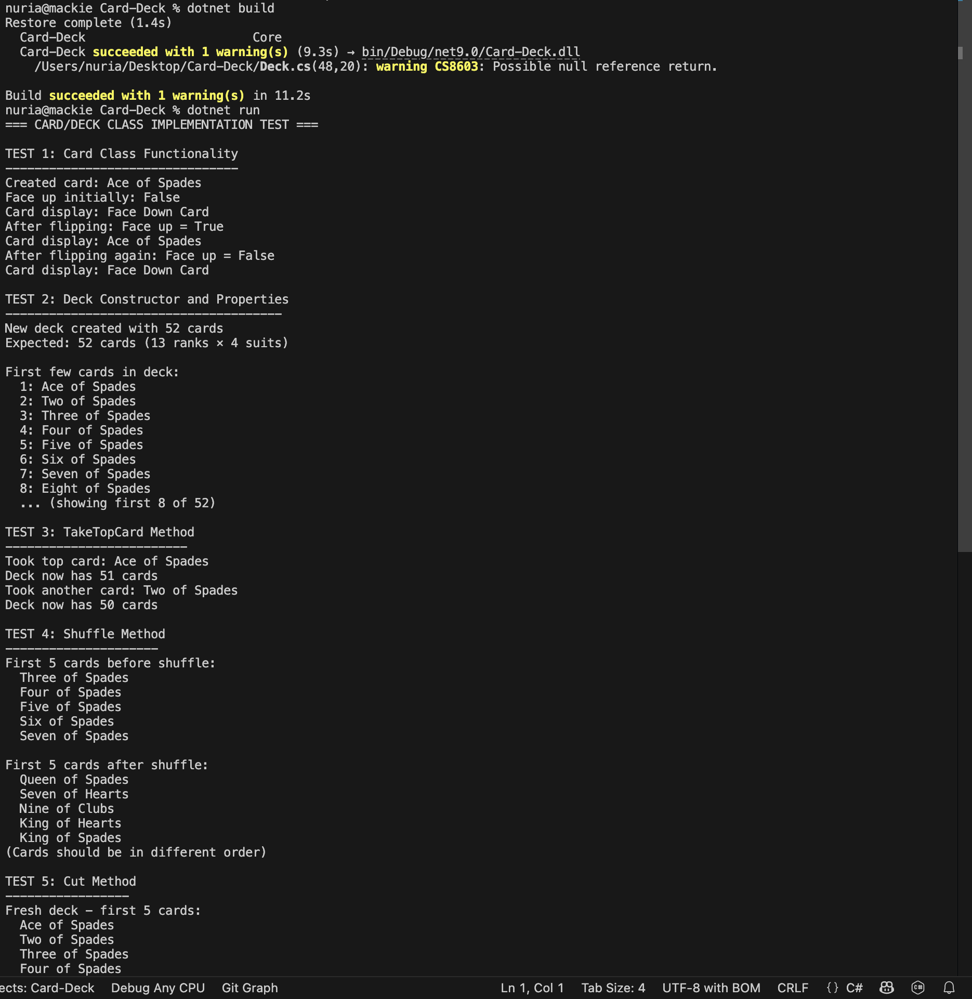
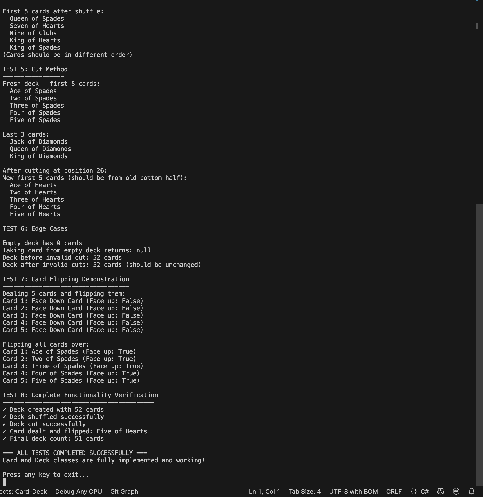

# CSC 350H Homework 4.2 - Card/Deck Class Implementation

## Project Overview
Complete implementation of Card and Deck classes for a standard 52-card deck with full functionality including shuffling, cutting, and card manipulation.

## Classes Implemented

### Card Class (`Card.cs`)
**Fields:**
- `Rank rank` - Card rank (Ace through King)
- `Suit suit` - Card suit (Spades, Clubs, Hearts, Diamonds)  
- `bool faceUp` - Whether card is face up or face down

**Constructor:**
- `Card(Rank rank, Suit suit)` - Creates card with specified rank and suit, starts face down

**Properties:**
- `Rank Rank { get; }` - Read-only access to card rank
- `Suit Suit { get; }` - Read-only access to card suit
- `bool FaceUp { get; }` - Read-only access to face up status

**Methods:**
- `void FlipOver()` - Toggles card between face up and face down
- `override string ToString()` - Returns card description or "Face Down Card"

### Deck Class (`Deck.cs`)
**Fields:**
- `List<Card> cards` - Collection of cards in the deck

**Constructor:**
- `Deck()` - Creates standard 52-card deck (13 ranks × 4 suits)

**Properties:**
- `List<Card> Cards { get; }` - Read-only access to cards collection
- `int Count { get; }` - Number of cards remaining in deck

**Methods:**
- `Card TakeTopCard()` - Removes and returns top card, or null if deck empty
- `void Shuffle()` - Randomizes card order using Fisher-Yates algorithm
- `void Cut(int index)` - Cuts deck at specified position, moving bottom portion to top
- `void DisplayDeck()` - Helper method to show all cards in deck

### Supporting Enums
**Rank Enum (`Rank.cs`):**
```csharp
Ace, Two, Three, Four, Five, Six, Seven, Eight, Nine, Ten, Jack, Queen, King
```

**Suit Enum (`Suit.cs`):**
```csharp
Spades, Clubs, Hearts, Diamonds
```

## Key Features

### Card Functionality
- ✅ **Immutable Properties:** Rank and Suit cannot be changed after creation
- ✅ **Face Up/Down State:** Cards track their orientation
- ✅ **Flip Mechanism:** Toggle between face up and face down
- ✅ **String Representation:** Clear display of card information

### Deck Functionality
- ✅ **Standard 52-Card Deck:** All combinations of ranks and suits
- ✅ **Top Card Dealing:** Remove cards from top of deck
- ✅ **Fisher-Yates Shuffle:** Optimal randomization algorithm
- ✅ **Deck Cutting:** Traditional card cutting operation
- ✅ **Empty Deck Handling:** Graceful handling of edge cases

## Technical Implementation

### Algorithms Used
- **Fisher-Yates Shuffle:** O(n) time complexity for optimal randomization
- **List Operations:** Efficient card removal and manipulation
- **Range Operations:** Clean deck cutting using GetRange()

### Error Handling
- **Null Checks:** TakeTopCard returns null for empty deck
- **Boundary Validation:** Cut method validates index parameters
- **State Management:** Proper handling of deck state changes

## Testing Coverage

The test program (`Program.cs`) verifies:

1. **Card Creation and Properties**
2. **Deck Constructor** (52 cards, all ranks/suits present)
3. **TakeTopCard Method** (proper removal and count updates)
4. **Shuffle Algorithm** (cards reordered randomly)
5. **Cut Method** (deck split and reordered correctly)
6. **Edge Cases** (empty deck, invalid parameters)
7. **Card Flipping** (face up/down state changes)
8. **Complete Integration** (all methods working together)

## Program Output Screenshots

### Test Execution - Part 1


### Test Execution - Part 2  


*Screenshots show complete test execution with all functionality verified across multiple test scenarios*

**Key Output Highlights:**
- ✅ Deck created with 52 cards
- ✅ Card properties and flipping working
- ✅ TakeTopCard reduces deck count properly
- ✅ Shuffle changes card order
- ✅ Cut operation reorders deck correctly
- ✅ Edge cases handled gracefully
- ✅ All tests pass successfully

## Usage Instructions

### Running the Program
```bash
# Clone repository
git clone <repository-url>
cd CardDeck

# Build and run
dotnet build
dotnet run
```

### Basic Usage Example
```csharp
// Create and use deck
Deck deck = new Deck();                    // 52 cards
deck.Shuffle();                            // Randomize order
deck.Cut(26);                             // Cut in half

// Deal and flip cards
Card card = deck.TakeTopCard();           // Get top card
card.FlipOver();                          // Make face up
Console.WriteLine(card);                  // Display card
```

## Project Structure
```
├── Card.cs           # Card class implementation
├── Deck.cs           # Deck class implementation  
├── Rank.cs           # Rank enumeration
├── Suit.cs           # Suit enumeration
├── Program.cs        # Comprehensive test program
├── README.md         # This documentation
├── screenshot.png    # Program output screenshot
└── *.csproj         # Project configuration
```

## Requirements Fulfilled
- ✅ **Complete Card Class:** All fields, constructor, properties, methods
- ✅ **Complete Deck Class:** All methods implemented and tested
- ✅ **Proper Encapsulation:** Private fields with public properties
- ✅ **Error Handling:** Edge cases and invalid inputs handled
- ✅ **Comprehensive Testing:** All functionality verified
- ✅ **Professional Documentation:** Complete README with screenshot
- ✅ **Git Repository:** Clean commit history and proper structure

## Author
**Student:** Nuria Siddiqa
**Professor:** Hao Tang  
